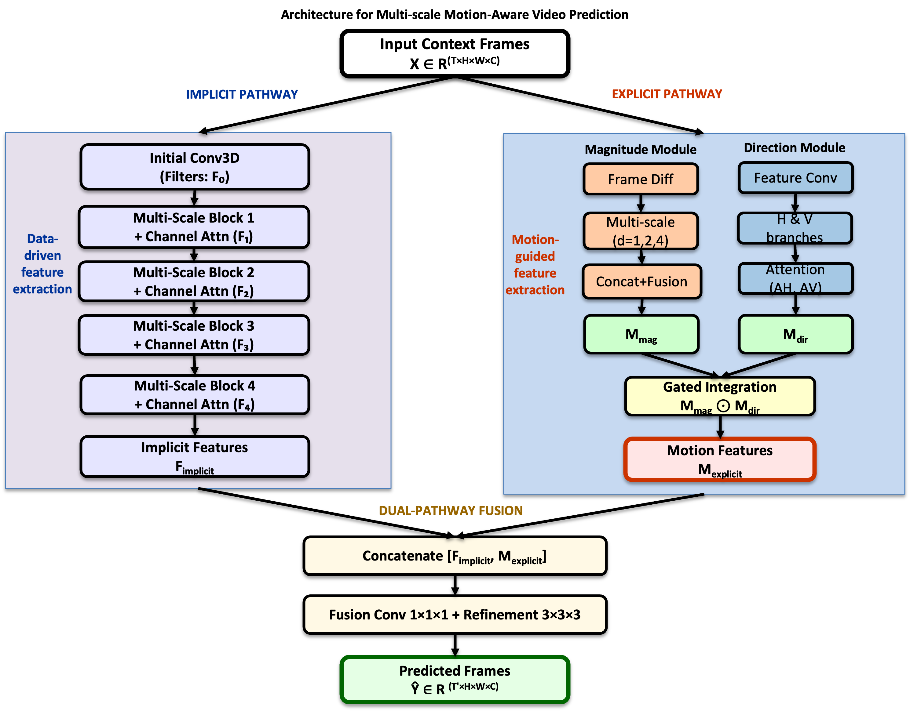

# MSMANet: Multi-Scale Motion-Aware Network for Video Prediction

Implementation of "Multi-Scale Motion-Aware Network: Enhancing Video Prediction with Lightweight Architecture".



## Abstract

Video prediction models forecast future video frames from given context frames, playing a crucial role in applications such as autonomous driving, robot navigation, and video surveillance. Despite advancements, these models often suffer from motion blur due to inadequate motion perception. To address this, we propose MSMANet, a lightweight Multi-Scale Motion-Aware Network that combines implicit spatiotemporal learning with explicit motion decomposition. MSMANet captures orthogonal motion components at multiple scales using anisotropic 3D convolutions and integrates these with implicit features through a channel attention mechanism. Evaluated on four benchmark datasets, MSMANet achieves competitive performance with significantly fewer parameters (3.1M vs. 38.3M)
compared to state-of-the-art models. On TaxiBJ, MSMANet achieves the lowest MSE of 34.9, outperforming baselines by 14-19%. On KTH, it attains the highest PSNR of 29.64dB. On BAIR, MSMANet achieves the lowest FVD of 51.3. These results demonstrate MSMANet’s superior temporal coherence and parameter efficiency, making it suitable for resource-constrained deployment scenarios.


<!-- ## Datasets

### 1. TaxiBJ (Traffic Flow Prediction)
- **Download:** [IEEE DataPort - TaxiBJ Dataset](https://ieee-dataport.org/documents/traffic-datsets-abilene-geant-taxibj)
- **Alternative:** [GitHub Mirror](https://github.com/TolicWang/DeepST/tree/master/data/TaxiBJ)
- **Format:** Taxi GPS trajectory data (Beijing, 2013-2016)
- **Task:** Predict 4 future frames from 4 context frames (32×32)

### 2. KTH Actions (Human Action Videos)
- **Download:** [KTH Dataset](https://www.csc.kth.se/cvap/actions/)
- **Format:** Human action videos (walking, jogging, running, boxing, hand waving, hand clapping)
- **Task:** Predict 10 future frames from 10 context frames (128×128)

### 3. BAIR Robot Pushing (Robot Manipulation)
- **Download:** [BAIR Dataset](http://rail.eecs.berkeley.edu/datasets/bair_robot_pushing_dataset_v0.tar)
- **Format:** Robot arm pushing objects (64×64 RGB)
- **Task:** Predict 14 future frames from 2 context frames

```bash
wget http://rail.eecs.berkeley.edu/datasets/bair_robot_pushing_dataset_v0.tar
tar -xvf bair_robot_pushing_dataset_v0.tar
```

### 4. Moving MNIST (Digit Sequences)
- **Download:** Automatically generated (see code)
- **Format:** Moving handwritten digits (64×64 grayscale)
- **Task:** Predict 10 future frames from 10 context frames -->

## Quick Start

### Training
```python
from model import build_msmanet

# Build model
model = build_msmanet(
    input_shape=(4, 32, 32, 2),  # TaxiBJ: 4 frames, 32×32, 2 channels (inflow/outflow)
    output_frames=4,
    filters=[128, 128, 128, 64]
)

# Train
model.compile(optimizer='adam', loss='mse')
model.fit(train_data, epochs=100)
```

### Inference
```python
# Load pretrained weights
model.load_weights('weights/taxibj_msmanet.h5')

# Predict
predictions = model.predict(context_frames)
```


<!-- Or download from Google Drive:
- [TaxiBJ weights](https://drive.google.com/YOUR_LINK)
- [KTH weights](https://drive.google.com/YOUR_LINK)
- [BAIR weights](https://drive.google.com/YOUR_LINK)
- [Moving MNIST weights](https://drive.google.com/YOUR_LINK) -->

## Model Architecture

MSMANet consists of three main components:

1. **Implicit Pathway:** Multi-scale encoder with dilated convolutions (d=1, 2, 4)
2. **Explicit Motion Pathway:** 
   - Motion Magnitude Module (multi-scale temporal differences)
   - Motion Direction Module (anisotropic H×W convolutions)
3. **Fusion & Decoder:** Channel attention-based fusion with temporal upsampling

**Key Features:**
- Multi-scale spatiotemporal learning
- Explicit motion decomposition (magnitude × direction)
- Lightweight (3.1M parameters)
- Superior temporal coherence (lowest FVD/MSE)

<!-- ## Citation

```bibtex
@article{msmanet2025,
  title={Multi-Scale Motion-Aware Network: Enhancing Video Prediction with Lightweight Architecture},
  author={Jena, Biswa Ranjan and Mishra, Debahuti and Sahoo, Alok Ranjan and Mishra, Smita Prava},
  journal={The Visual Computer},
  year={2025},
  publisher={Springer}
}
``` -->

## Acknowledgments

- **TaxiBJ:** [IEEE DataPort](https://ieee-dataport.org/documents/traffic-datsets-abilene-geant-taxibj) - Zhang et al. (2017)
- **KTH:** [Schuldt et al. (2004)](https://www.csc.kth.se/cvap/actions/)
- **BAIR:** [Ebert et al. (2017)](https://sites.google.com/site/brainrobotdata/home)
- **Moving MNIST:** [Srivastava et al. (2015)](http://www.cs.toronto.edu/~nitish/unsupervised_video/)

<!-- ## Statement 
We are  -->